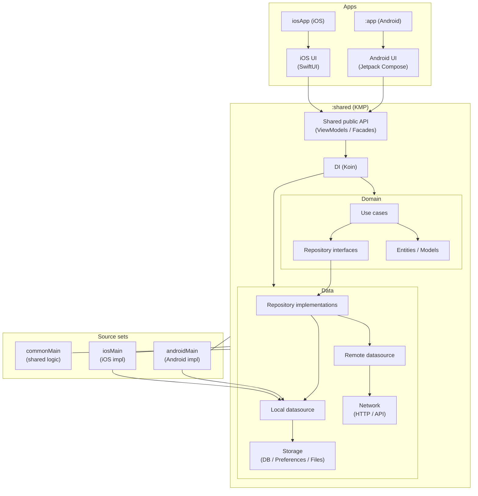

[](https://github.com/EduYube/cv-kmp/actions/workflows/ci.yml)
# CV KMP

App de CV construida con Kotlin Multiplatform (KMP) para compartir lógica entre Android e iOS.
- Android UI: Jetpack Compose (nativo)
- iOS UI: SwiftUI (nativo)

## Commit convention (Conventional Commits)

Format:
`type(scope): description`

Types we use:
- feat, fix, docs, chore, refactor, test, build, ci

Common scopes in this repo:
- shared, shared-di, domain, data, presentation, android, ios, ci, build

Examples:
- feat(shared-di): bootstrap koin with platform modules
- fix(android): use unique namespace for shared module
- docs(shared): document koin bootstrap and initKoin api decision

### Local git commit template
Run:
`git config commit.template .gitmessage`

## Modules
- `app`: Android application
- `shared`: KMP shared module (domain/data/presentation)
- `iosApp`: scaffold/documentación para la app iOS (se compilará en macOS)

## Build
### Android
- `./gradlew :app:assembleDebug`
- Ejecutar desde Android Studio

### Shared
- `./gradlew :shared:build`

### iOS (CI / macOS)
El framework iOS se valida en CI (runner macOS) ejecutando tasks `linkDebugFramework...`.
En Windows no se puede compilar iOS (requiere Xcode).

## Architecture

This project follows a Kotlin Multiplatform (KMP) structure.

### Modules

- `app` → Android application module (Jetpack Compose UI)
- `shared` → Kotlin Multiplatform module
    - `commonMain` → Shared business logic
    - `androidMain` → Android-specific implementations
    - `iosMain` → iOS-specific implementations
- `iosApp` → Swift iOS application (consumer of shared module)

### Dependency Flow

Both Android and iOS apps depend on the `shared` module.


---
## Dependency Injection (DI)
### Contexto en este proyecto
La inyección de dependencias se gestiona mediante **Koin** y se inicializa desde la clase `Application` de Android (`CvKmpApp`) a través de:

```kotlin
initKoin()
```
El arranque del contenedor de dependencias vive dentro del módulo :shared, lo que permite que la arquitectura sea coherente en un entorno Kotlin Multiplatform.

#### ¿Por qué Koin?

Este proyecto está construido con Kotlin Multiplatform (KMP), por lo que la solución de DI debe:

* Funcionar tanto en Android como en iOS.
* Ser ligera y fácil de entender.
* No depender de procesadores de anotaciones.
* Encajar bien en un proyecto orientado al aprendizaje arquitectónico.

Se eligió Koin porque:

✅ Es compatible con Kotlin Multiplatform.
✅ No requiere configuración compleja ni generación de código.
✅ Permite definir los módulos directamente en :shared.
✅ Reduce fricción inicial frente a soluciones como Dagger/Hilt.

Trade-offs asumidos

⚠️ Es una solución de DI en tiempo de ejecución (runtime).
⚠️ Algunos errores de wiring pueden detectarse en ejecución en lugar de en compilación.

En este proyecto se prioriza simplicidad, claridad arquitectónica y compatibilidad multiplataforma frente a máxima seguridad en compile-time.

#### Dónde vive la DI

La configuración de dependencias está organizada así:

shared
 ├── commonMain
 │   ├── di
 │   │   ├── initKoin()
 │   │   ├── commonModule
 │   │   └── expect fun platformModule()
 │
 ├── androidMain
 │   └── actual fun platformModule()
 │
 └── iosMain
     └── actual fun platformModule()

* commonModule define dependencias compartidas.
* platformModule() utiliza el patrón expect/actual para aportar implementaciones específicas de cada plataforma.
* Android inicializa el contenedor, pero la definición vive en shared.

#### Principio arquitectónico aplicado

El dominio no depende de Koin.

* Domain define contratos (interfaces).
* Data implementa esos contratos.
* DI conecta las implementaciones con sus consumidores.
* La capa de aplicación solo dispara la inicialización.

Dirección de dependencias:
```
Presentation → Domain → Data
                 ↑
                DI
```

La DI es un mecanismo de composición, no una dependencia del negocio.

Decisión: no exponer KoinApplication

Se decidió que initKoin() no devuelva KoinApplication por:

* Reducir el acoplamiento con el framework de DI.
* Evitar exponer detalles internos fuera de :shared.
* Facilitar un posible cambio de framework en el futuro.
* Mantener :shared como frontera arquitectónica limpia.
* Esta decisión es consciente y no tiene impactos negativos a futuro.