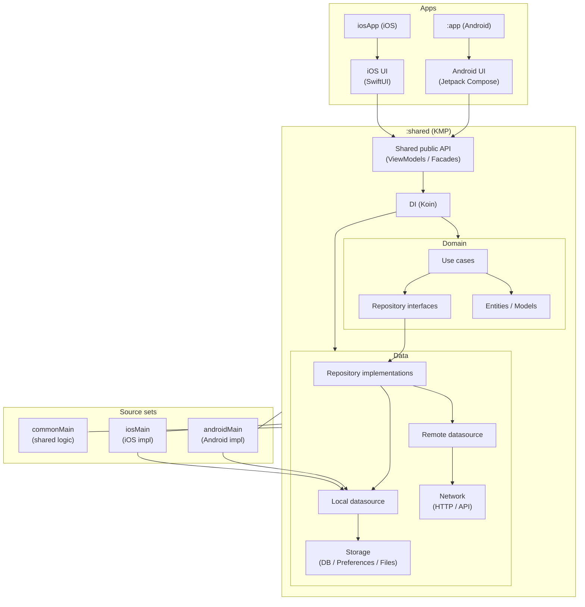

# CV KMP

App de CV construida con Kotlin Multiplatform (KMP) para compartir lógica entre Android e iOS.
- Android UI: Jetpack Compose (nativo)
- iOS UI: SwiftUI (nativo)

## Commit convention (Conventional Commits)

Format:
`type(scope): description`

Types we use:
- feat, fix, docs, chore, refactor, test, build, ci

Common scopes in this repo:
- shared, shared-di, domain, data, presentation, android, ios, ci, build

Examples:
- feat(shared-di): bootstrap koin with platform modules
- fix(android): use unique namespace for shared module
- docs(shared): document koin bootstrap and initKoin api decision

### Local git commit template
Run:
`git config commit.template .gitmessage`

## Modules
- `app`: Android application
- `shared`: KMP shared module (domain/data/presentation)
- `iosApp`: scaffold/documentación para la app iOS (se compilará en macOS)

## Build
### Android
- `./gradlew :app:assembleDebug`
- Ejecutar desde Android Studio

### Shared
- `./gradlew :shared:build`

### iOS (CI / macOS)
El framework iOS se valida en CI (runner macOS) ejecutando tasks `linkDebugFramework...`.
En Windows no se puede compilar iOS (requiere Xcode).

## Architecture

This project follows a Kotlin Multiplatform (KMP) structure.

### Modules

- `app` → Android application module (Jetpack Compose UI)
- `shared` → Kotlin Multiplatform module
    - `commonMain` → Shared business logic
    - `androidMain` → Android-specific implementations
    - `iosMain` → iOS-specific implementations
- `iosApp` → Swift iOS application (consumer of shared module)

### Dependency Flow

Both Android and iOS apps depend on the `shared` module.

---